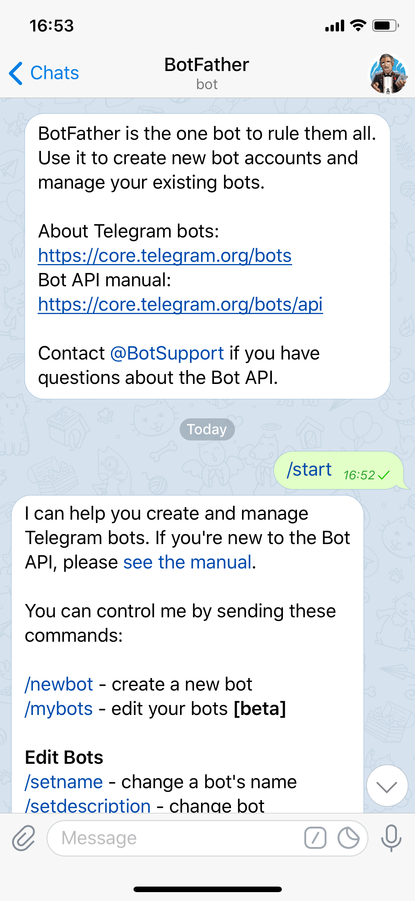

# tie-api-example-telegram
This node.js example connector allows you to make your Teneo bot available on Telegram.


## Prerequisites
### Https
The Telegram Bot API requires the connector to be available via https. Ngrok is recommended for this.

1. Make sure your connector is available via https. When running locally you can for example use [ngrok](https://ngrok.com) for this. Run the connector on port 8443 by default. 
Only a few are supported in Telegram.
    ```
    ngrok http 8443
    ```
2. Running the command above will display a public https URL, copy it, we will use it as a `Webhook URL` for the following steps.


## Running the connector locally
### Telegram Setup

To register a bot in Telegram, you must first talk to the [t.me/BotFather](Botfather), which is itself a bot. 



1. In Telegram, start a chat with the Botfather.
2. Send the command /newbot from the list of options to start the process.
3. Follow the instructions to set up a name (*what the page will be called*) and a username (*how you can refer to the bot using @*) for your bot.
4. Save the token generated in the chat. You will need it later.
5. Paste it into the config variables.


### Connector Setup Instructions

1. Download or clone the connector source code:
    ```
    git clone https://github.com/ ...
    ```
2. Install dependencies by running the following command in the folder where you stored the source:
    ```
    npm install
    ``` 
3. Start the connector with the following command (replacing the environment variables with your own values):
    ```
    WEBHOOK_FOR_TELEGRAM=<a_public_webhook_URL> TELEGRAM_TOKEN=<your_telegram_token> TENEO_ENGINE_URL=<your_engine_url> node server.js
    ```

Open a chat by searching for the bot name you defined earlier, and speak to your bot!


## Running the connector on Heroku

Click the button below to deploy the connector to Heroku:

[](https://heroku.com/deploy?template=https://github.com/a-hoffmann/as-telegram)

In the 'Config Vars' section, add the following:
* **WEBHOOK_FOR_TELEGRAM:** The url of this heroku app - `https:/[your heroku app name].herokuapp.com`
* **TELEGRAM_TOKEN:** The token for your bot.
* **TENEO_ENGINE_URL:** The engine url


Next, follow the Telegram Setup instructions above. 
